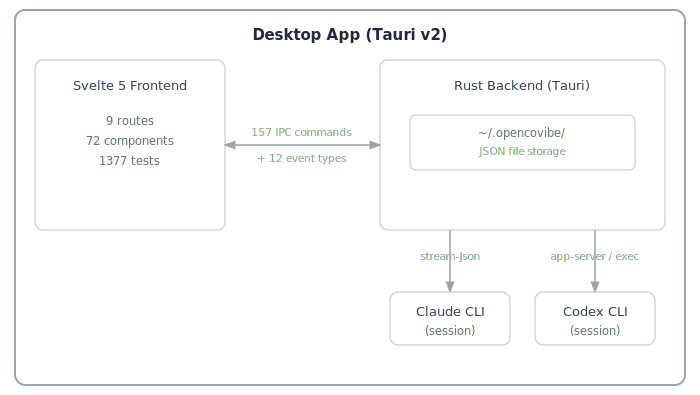

<p align="center">
  
</p>

<p align="center">
  <strong>Local-first desktop app for AI-assisted vibe coding</strong>
</p>

<p align="center">
  <a href="#why-opencovibe">Why</a> &middot;
  <a href="#key-capabilities">Capabilities</a> &middot;
  <a href="#quick-start">Quick Start</a> &middot;
  <a href="#supported-providers">Providers</a> &middot;
  <a href="#architecture">Architecture</a> &middot;
  <a href="#license">License</a>
</p>

<p align="center">
  <b>English</b> | <a href="README.zh-CN.md">简体中文</a>
</p>

---

<p align="center">
  
</p>

## Why OpenCovibe?

AI coding CLIs like Claude Code are powerful, but they run inside a terminal. That means no persistent dashboard, no visual diff review, no cross-session history, and no multi-provider switching. OpenCovibe wraps these CLIs with a native desktop UI that adds the layers the terminal can't provide — while keeping all your data **stored locally**. (Remote model APIs require network access; the app itself has no cloud backend.)

| Agent | Status |
|-------|--------|
| [Claude Code](https://github.com/anthropics/claude-code) | Supported |
| [Codex](https://github.com/openai/codex) | Supported — interactive `app-server` mode (default) with `exec` fallback |

**Platform status**: Currently developed and tested primarily on **macOS**. Windows and Linux builds are functional but have not been thoroughly tested for compatibility — contributions and bug reports are welcome.

**Core principle**: Wrap the CLI, surface the work, keep it local.

## Key Capabilities

### What the CLI doesn't give you

| Capability | What OpenCovibe adds |
|------------|---------------------|
| **Visual Tool Cards** | Every tool call (Read, Edit, Bash, Grep, Write, WebFetch, …) rendered as an inline card with syntax-highlighted diffs, structured output, and one-click copy |
| **Run History & Replay** | Browse all past sessions, full event replay, resume / fork from any point, soft-delete with recovery |
| **Multi-Provider Switching** | Use Claude Code with 15+ API providers (DeepSeek, Kimi, Zhipu, Bailian, DouBao, MiniMax, OpenRouter, Ollama, …) — hot-switch without restarting |
| **Remote Browser Access** | Embedded web server for browser-based access over LAN or HTTP tunnels (ngrok / cloudflared) |
| **File Explorer** | Browse and edit project files with syntax highlighting, markdown preview, image preview, and git diff view |
| **Memory Editor** | Create and edit CLAUDE.md, project-scoped and user-scoped memory files with live preview |
| **Agent Management** | Visual editor to create, edit, and manage custom agent definitions (.md files) with form and source modes |
| **Permission Rules** | Manage CLI permission allow/deny rules at user and project level with a visual rule editor |
| **Usage Analytics** | Per-model token breakdown, cost tracking, daily heatmap, stacked model chart, session-level stats |
| **Team Dashboard** | Read-only view into Claude Code multi-agent teams — task lists, teammate status, message flow |
| **Activity Monitor** | Real-time hook event stream, tool activity timeline, file tracking panel, subagent tracking with nested tool cards |
| **Plugin Marketplace** | Browse, install, and manage Claude Code plugins and skills from a visual marketplace |
| **MCP Management** | Discover MCP servers, view per-server status, reconnect / toggle from a panel |
| **Inline Permissions** | Rich permission review UI with batch Allow/Deny panel, CLI-suggested "Always Allow" rules, and AskUserQuestion rendering |
| **CLI Session Import** | Discover and import existing Claude Code CLI sessions into OpenCovibe |
| **Rewind** | Checkpoint and selectively revert file changes with dry-run preview |
| **Remote Hosts** | Configure SSH hosts for remote CLI execution with key generation wizard and connectivity testing |
| **Preview & Element Picker** | Open a localhost preview in a companion window, interactively pick page elements, and insert structured context (DOM path, styles, HTML snippet) into the chat |
| **Ralph Loop** | Auto-iterate the same prompt until a completion condition is met — hands-free coding with configurable max iterations |
| **Doctor Diagnostics** | System health checks for CLI, platform, SSH, and proxy configuration |

### Features

- **Rich Chat UI** — Markdown, syntax highlighting, thinking blocks, image attachments, file diffs, collapsible tool burst groups
- **Session Control** — Create, resume, fork, rename sessions; plan mode toggle; model hot-switch; context history tracking
- **Drag & Drop** — Native file drag-drop for images, PDFs, directories, and path references
- **Project Folders** — Sidebar project selector with per-project scoping for memory, permissions, and sessions
- **Inline Slash Commands** — `/model`, `/diff`, `/todos`, `/tasks`, `/doctor`, `/copy`, `/stats`, `/preview`, `/ralph`, and more — rendered natively in-app
- **Keyboard Shortcuts** — Fully customizable keybindings with chord support and conflict detection
- **Hook Manager** — Configure upstream CLI hooks for event-driven automation
- **i18n** — English and Chinese (Simplified) with lightweight reactive runtime
- **System Tray** — Hide to tray; background sessions keep running with native notifications
- **Dark / Light Theme** — CSS variable-based theming with UI zoom control
- **Auto Update** — In-app update checker with download links
- **Setup Wizard** — Guided CLI detection, authentication, and provider configuration on first launch

## Quick Start

### Option A: Download Pre-built Binary (macOS)

Download the latest `.dmg` from [Releases](https://github.com/AnyiWang/OpenCovibe/releases) — universal binary, supports both Apple Silicon and Intel Macs.

> **Note**: The app is not code-signed. On first launch, right-click and select "Open" to bypass macOS Gatekeeper.

### Option B: Automated Setup (macOS)

```bash
git clone https://github.com/AnyiWang/OpenCovibe.git
cd OpenCovibe
./scripts/setup.sh          # add --yes to skip confirmation prompts
npm run tauri dev
```

The setup script detects missing dependencies (Xcode CLI Tools, Homebrew, Node.js, Rust) and installs them automatically.

### Option C: Manual Setup

**Prerequisites:**

- [Node.js](https://nodejs.org/) >= 20
- [Rust](https://rustup.rs/) >= 1.75

**macOS:**
```bash
xcode-select --install
brew install node
curl --proto '=https' --tlsv1.2 -sSf https://sh.rustup.rs | sh
```

**Linux (Debian/Ubuntu):**
```bash
sudo apt install libwebkit2gtk-4.1-dev build-essential curl wget file \
  libxdo-dev libssl-dev libayatana-appindicator3-dev librsvg2-dev
curl --proto '=https' --tlsv1.2 -sSf https://sh.rustup.rs | sh
```

**Windows:**
```powershell
# Install Rust from https://rustup.rs
# Install Node.js from https://nodejs.org
```

**Build & Run:**

```bash
git clone https://github.com/AnyiWang/OpenCovibe.git
cd OpenCovibe
npm install
npm run tauri dev
```

### Setup Wizard

On first launch, OpenCovibe guides you through:

1. **CLI Detection** — Auto-detects Claude Code and Codex CLIs, offers installation if missing
2. **Authentication** — OAuth login or API key for 15+ providers
3. **Ready** — Start coding

You can re-run the wizard anytime from **Settings > General > Setup Wizard**.

## Supported Providers

### LLM Providers

| Provider | Endpoint | Auth |
|----------|----------|------|
| Anthropic | Official API | API Key |
| DeepSeek | `api.deepseek.com/anthropic` | Bearer |
| Kimi (Moonshot) | `api.moonshot.cn/anthropic` | Bearer |
| Kimi For Coding | `api.kimi.com/coding/` | Bearer |
| Zhipu (智谱) | `open.bigmodel.cn/api/anthropic` | Bearer |
| Zhipu (智谱 Intl) | `api.z.ai/api/anthropic` | Bearer |
| Bailian (Coding Plan) | `coding.dashscope.aliyuncs.com/apps/anthropic` | Bearer |
| Bailian (百炼 API) | `dashscope.aliyuncs.com/apps/anthropic` | Bearer |
| DouBao (豆包) | `ark.cn-beijing.volces.com/api/coding` | Bearer |
| MiniMax | `api.minimax.io/anthropic` | Bearer |
| MiniMax (China) | `api.minimaxi.com/anthropic` | Bearer |
| Xiaomi MiMo (小米) | `api.xiaomimimo.com/anthropic` | Bearer |
| Xiaomi MiMo (Token Plan) | `token-plan-cn.xiaomimimo.com/anthropic` | Bearer |
| Tencent Hunyuan (混元) | `api.hunyuan.cloud.tencent.com/anthropic` | Bearer |
| SiliconFlow (硅基流动) | `api.siliconflow.com/` | Bearer |

### API Gateway

| Platform | Endpoint | Auth |
|----------|----------|------|
| Vercel AI Gateway | `ai-gateway.vercel.sh` | Bearer |
| OpenRouter | `openrouter.ai/api` | Bearer |
| AiHubMix | `aihubmix.com` | Bearer |
| ZenMux | `zenmux.ai/api/anthropic` | Bearer |

### Local

| Platform | Endpoint |
|----------|----------|
| Ollama | `localhost:11434` |
| [CC Switch](https://github.com/farion1231/cc-switch) | `localhost:15721` |
| [Claude Code Router](https://github.com/musistudio/claude-code-router) | `localhost:3456` |
| Custom | Any Anthropic-compatible endpoint |

## Architecture

<p align="center">
  
</p>

**Tech Stack:**

| Layer | Technology |
|-------|-----------|
| Framework | [Tauri v2](https://v2.tauri.app/) (Rust backend + WebView) |
| Frontend | [Svelte 5](https://svelte.dev/) + [SvelteKit](https://svelte.dev/docs/kit/) (adapter-static) |
| Styling | [Tailwind CSS](https://tailwindcss.com/) v3 + CSS variables |
| Terminal | [xterm.js](https://xtermjs.org/) |
| Markdown | [marked](https://marked.js.org/) + [highlight.js](https://highlightjs.org/) + [DOMPurify](https://github.com/cure53/DOMPurify) |
| i18n | Custom lightweight runtime (en + zh-CN) |
| Testing | [Vitest](https://vitest.dev/) |

**Agent Communication:**

Each session is a long-lived, multi-turn process managed by a per-run session actor. **Claude Code** communicates over a bidirectional stream-JSON protocol (stdin/stdout) with an interactive control protocol. **Codex** supports two transports: `codex app-server` (bidirectional JSON-RPC — the **default**, unlocking interactive approvals, mid-turn steer, fork/rewind/compact/goal, image input, and live command output) or `codex exec` (one-shot NDJSON per turn — a fallback, selectable in Settings for older Codex CLIs).

**Data Storage:**

All data is stored locally at `~/.opencovibe/` — no cloud, no database.

```
~/.opencovibe/
├── settings.json          # User settings
├── runs/                  # Session history
│   └── {run-id}/
│       ├── meta.json      # Run metadata
│       ├── events.jsonl   # Event log
│       └── artifacts.json # Summary
└── keybindings.json       # Custom shortcuts
```

## Development

```bash
npm install              # Install dependencies
npm run tauri dev        # Dev mode with hot-reload
npm test                 # Run tests
npm run lint:fix         # Lint
npm run format           # Format
```

## Contributing

Contributions are welcome! Please read [CONTRIBUTING.md](CONTRIBUTING.md) for development setup, coding conventions, and PR guidelines.

## Star History

[](https://star-history.com/#AnyiWang/OpenCovibe&Date)

## License

Licensed under the [Apache License 2.0](LICENSE).

Copyright 2025-2026 OpenCovibe Contributors.
